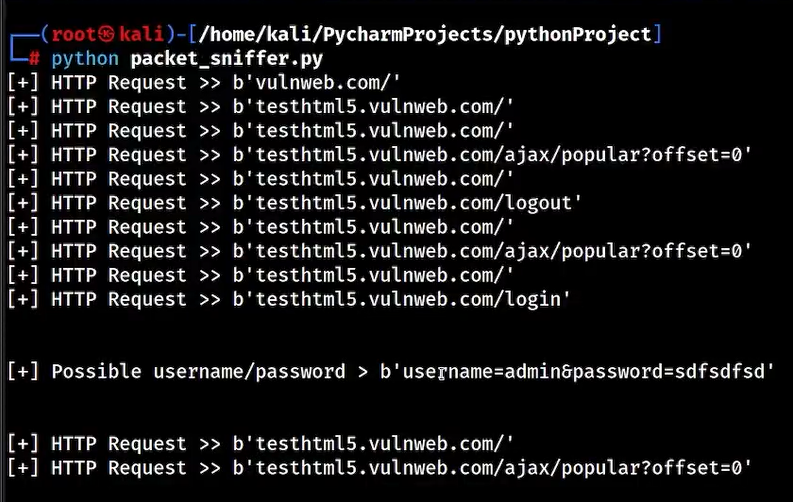
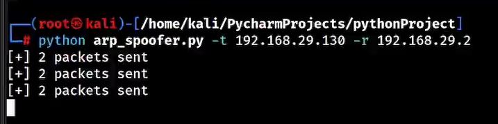

# Packet Sniffer

A Python-based packet sniffer built with Scapy to monitor and analyze HTTP traffic on a local network.

## Features

- Captures HTTP requests
- Displays host and requested paths
- Real-time packet monitoring
- Lightweight and educational project

## Requirements

- Python 3.x
- Scapy

## Installation

```bash
pip install -r requirements.txt
```

## Usage

⚠️ Note: Since this tool interacts with the network interface at a low level, it must be executed with administrative privileges (root/sudo).

Run the script by specifying your active network interface (e.g., eth0 or wlan0):

```bash
sudo python packet_sniffer.py
```


## Full Lab Execution (Man-in-the-Middle)

By default, the sniffer captures only local machine traffic. In a controlled lab environment, additional network traffic can be analyzed by routing it through a test setup.

### Step-by-Step Run:

1. Run the traffic redirection tool in a separate terminal within the lab environment, targeting the desired devices.
2. Run the Packet Sniffer in another terminal to capture and analyze the forwarded traffic.

```bash
sudo python arp_spoofer.py -t <target_ip> -r <gateway_ip>
```


## Disclaimer

This tool is developed strictly for educational purposes, security research, and authorized penetration testing in controlled and isolated lab environments.

Any use of this tool on networks or systems without explicit permission is strictly prohibited and may be illegal.

The developer is not responsible for any misuse of this software.